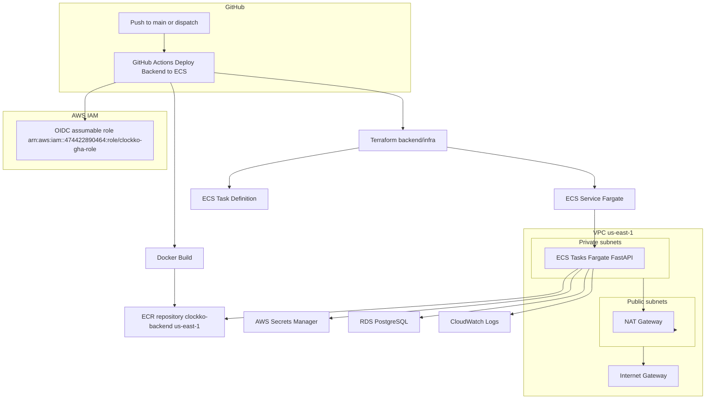
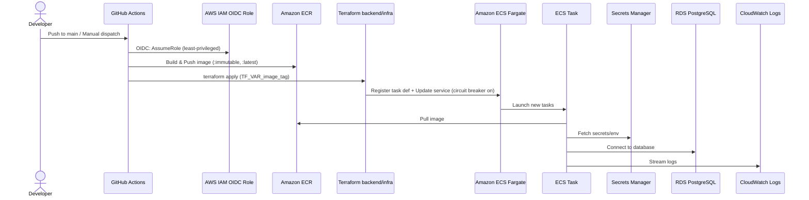

# Architecture overview

## Deployment flow

### If preview still doesn’t render

- VS Code sometimes needs an extension: “Markdown Preview Mermaid Support”.
- In that extension settings, set Security Level to “loose” to allow line breaks.
- GitHub renders Mermaid natively on repo pages; refresh if it’s cached.
- Raw Mermaid sources are available here:
  - `backend/infra/diagrams/architecture.mmd`
  - `backend/infra/diagrams/deployment_flow.mmd`
